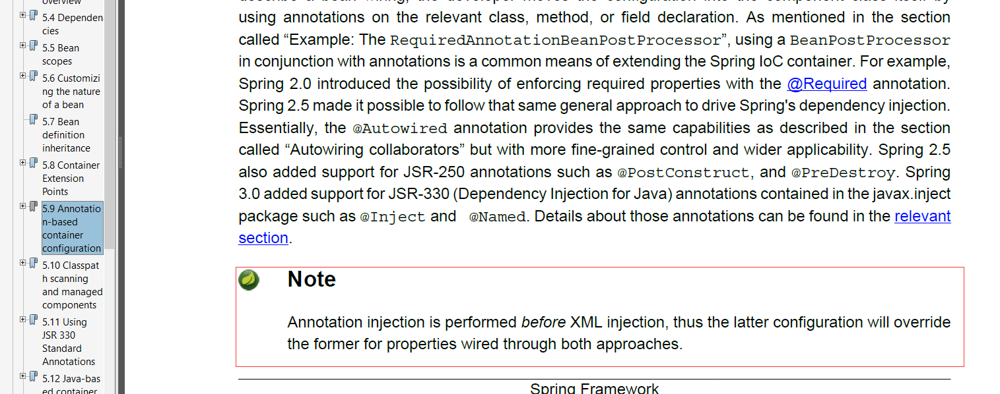

## 同名bean覆盖规则
1. 同名bean在xml中的覆盖注解的。
2. 不同xml文件中，同名bean按加载顺序，后者覆盖前者。
3. 同名bean在同一xml配置文件中时会报错。

		Caused by: org.springframework.beans.factory.parsing.BeanDefinitionParsingException: Configuration problem: Bean name 'hdpos.repository.beanOverrideTestDao' is already used in this <beans> element
		Offending resource: class path resource [overrider-test.xml]

		at org.springframework.beans.factory.parsing.FailFastProblemReporter.error(FailFastProblemReporter.java:68)
		at org.springframework.beans.factory.parsing.ReaderContext.error(ReaderContext.java:85)
		at org.springframework.beans.factory.parsing.ReaderContext.error(ReaderContext.java:80)
		at org.springframework.beans.factory.xml.BeanDefinitionParserDelegate.error(BeanDefinitionParserDelegate.java:318)

## 官方依据

