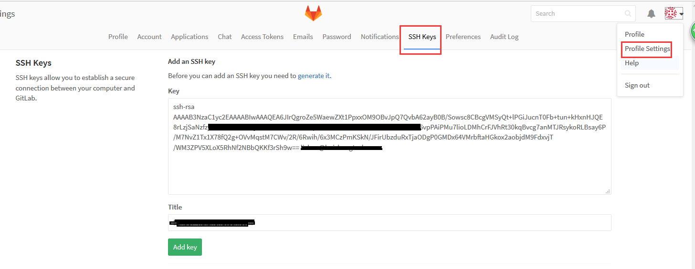

转自：https://www.cnblogs.com/lic309/p/6290597.html

前言:

　　最近公司需要将整体项目从svn迁移至gitlab上,经过几天的研究,现记录一下流程

　　整体思路是进行一次导入:

　　先通过subgit将svn整个import至本地,在与git上的项目进行合并.

1.硬件环境

　　git:git version 2.7.4

　　svn: 1.6.11

 　 subgit:3.2.2

2.下载subgit

　　官网下载subgit: https://subgit.com/

　　将subgit解压:　　　　

	tar -zcvf subgit-3.2.2.zip 
3.在gitlab上新建一个需要合并的项目

　　进入gitlab管理界面,新建项目:lclctest　　

	git@xx.xx.xx.xx:lclc/lclctest.git (我这边新建了一个lclc的组)
　　建好以备用.

 4.进入subgit-3.2.2/bin 目录,使用configure命令　　

	./subgit configure http://ip:port/svn/lclctest  lclctest
完成后会有一些提示:　　

	1) Adjust Subversion to Git branches mapping if necessary:
	    /root/lclctmp/tmp/subgit-3.2.2/bin/lclctest/subgit/config
	2) Define at least one Subversion credentials in default SubGit passwd file at:
	    /root/lclctmp/tmp/subgit-3.2.2/bin/lclctest/subgit/passwd
	   OR configure SSH or SSL credentials in the [auth] section of:
	    /root/lclctmp/tmp/subgit-3.2.2/bin/lclctest/subgit/config
	3) Optionally, add custom authors mapping to the authors.txt file(s) at:
	    /root/lclctmp/tmp/subgit-3.2.2/bin/lclctest/subgit/authors.txt
	4) Run SubGit 'install' command:
	    subgit install lclctest

意思是进行一些配置,然后进行install

　　配置config:由于3.2.2默认是配置好的,可以不进行配置　　

	trunk = trunk:refs/heads/master
	branches = branches/*:refs/heads/*
	branches = branches/features/*:refs/heads/features/*
	branches = hotfixes/*:refs/heads/hotfixes/*
	tags = tags/*:refs/tags/*
	shelves = shelves/*:refs/shelves/*

　　配置用户映射文件 author.txt 格式为:svnUser = Git User <user@example.com> (也可以不修改)
5.进行install

	$ ./subgit install lclctest
　　此步将连接svn,需要耗时一段时间.

　　完成后就把svn代码迁移到本地库了,这时候就需要用git push到远程库中

6.clone版本　　

 	git clone ./lclctest lclctest.git
7.进入lclctest.git目录　　

	git remote set-url origin git@yourip:lclc/lclctest.git(之前创建的git项目)
	git push origin master

在push的时候发现提示填写密码:

	git@ip's password:

　　此时说明需要进行身份验证,我们给git添加一个keygen就行了

7.1:生成keygen　

	cd ~
	ssh-keygen -t rsa -C "your_email@example.com"
　　生成的文件在 .ssh文件下有 id_rsa和id_rsa.pub文件

　　7.2:上传keygen

　　打开gitlab的管理界面
	
　　

 

  将id_rsa.pub文件中的内容复制到Key的文本框里.

再执行步骤7的git push origin master命令上传master

8.上传分支.

　　进入lclctest.git目录,使用命令查看分支　　

	git branch -a
结果:

	* master
	  remotes/origin/HEAD -> origin/master
	  remotes/origin/bugfix
	  remotes/origin/develop
	  remotes/origin/feature
	  remotes/origin/master

本项目一共有3个分支,分别是bugfix,develop,feature,分别进行上传

	git push origin remotes/origin/feature:refs/heads/feature
	git push origin remotes/origin/bugfix:refs/heads/bugfix
	git push origin remotes/origin/develop:refs/heads/develop
注意:冒号后面为远程库中的地址,必须以refs/heads开头.

9.上传tags

	git push --tags
 

 参考资料:

　　http://lattecake.com/post/20051

　　http://stackoverflow.com/questions/23251394/subgit-import-and-multiple-branches-directories