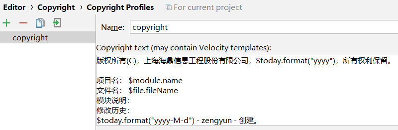
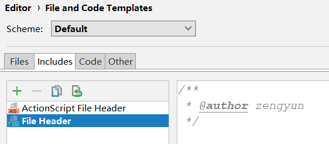
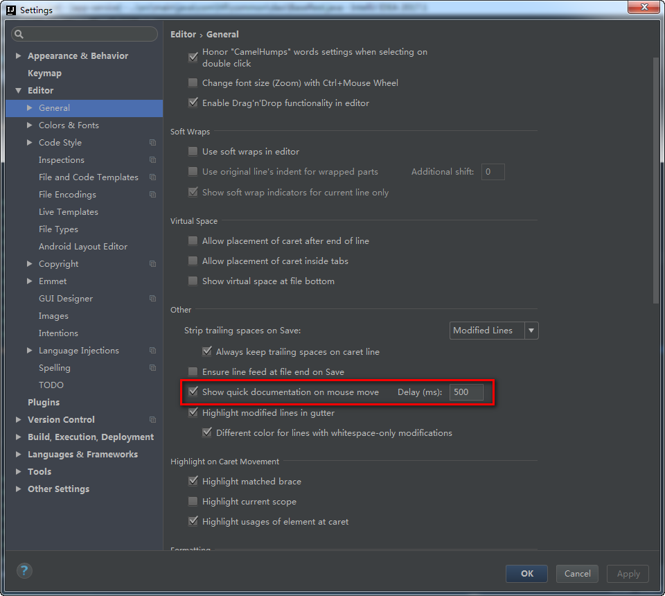
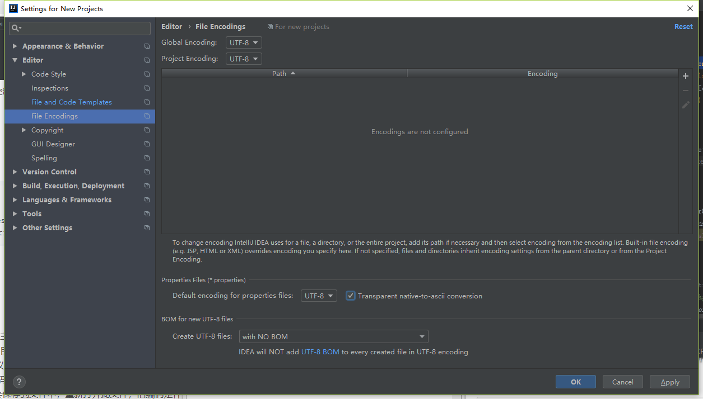
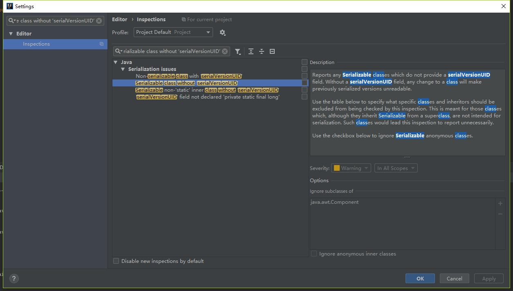

## 设置代码版权

	版权所有(C)，上海海鼎信息工程股份有限公司，$today.format("yyyy")，所有权利保留。
	
	项目名： $module.name
	文件名： $file.fileName
	模块说明：
	修改历史：
	$today.format("yyyy-M-d") - zengyun - 创建。

## IDEA设置文件头

	/**
	* @author zengyun
	*/

## 鼠标移动到类上显示文档document（javadoc）内容

## 文件编码设置
File->Settings->Editor->File Encodings

## 快捷键生成serialVersionUID
* 打开setting窗口后直接搜索 serializable class without ‘serialVersionUID’ 打上 √ 选项

* 然后鼠标点击类型，按下快捷键alt+entry 