## 执行计划

1. 【Table Scan】：遍历整个表，查找所有匹配的记录行。这个操作将会一行一行的检查，当然，效率也是最差的。
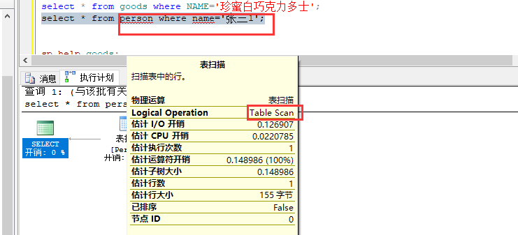

2. 【Index Scan】：根据索引，从表中过滤出来一部分记录，再查找所有匹配的记录行，显然比第一种方式的查找范围要小，因此比【Table Scan】要快。
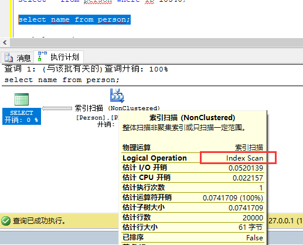

3. 【Index Seek】：根据索引，定位（获取）记录的存放位置，然后取得记录，因此，比起前二种方式会更快。

4. 【Clustered Index Scan】：和【Table Scan】一样。注意：不要以为这里有个Index，就认为不一样了。 其实它的意思是说：按聚集索引来逐行扫描每一行记录，因为记录就是按聚集索引来顺序存放的。
而【Table Scan】只是说：要扫描的表没有聚集索引而已，因此这二个操作本质上也是一样的
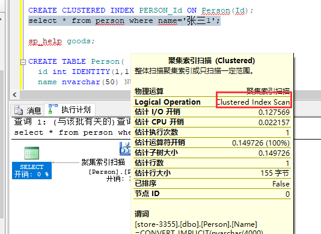

5. 【Clustered Index Seek】：直接根据聚集索引获取记录，最快！
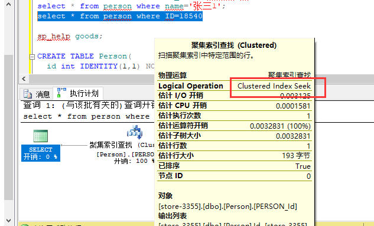

## sql server profiler

作用：事件探查器 是 SQL 跟踪的图形用户界面，用于监视 数据库引擎 或 Analysis Services 的实例

操作流程：

1. 创建跟踪， 一般选择Stored Procedures和TSQL
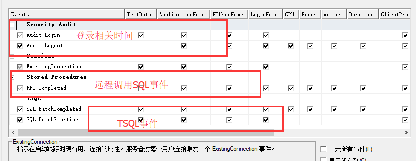

2. 筛选监控的条件。
ApplicationName：连接的app名字，比如说JDTS驱动填：“jtds”，sqlserver 管理工具查找填：“Microsoft SQL Server Management Studio - 查询”
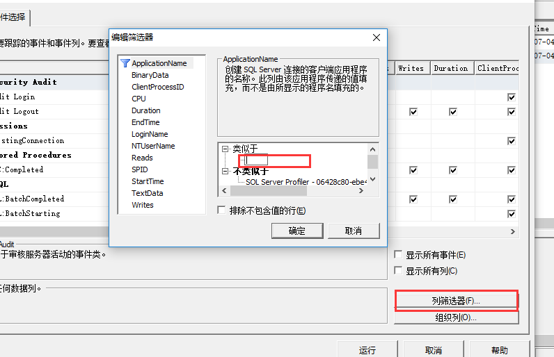

3. 运行跟踪
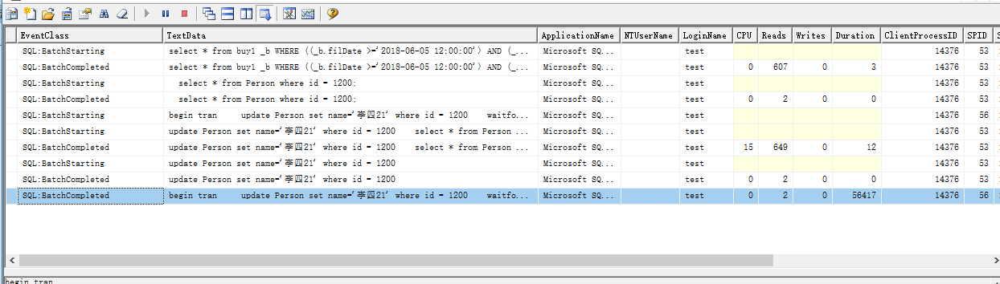

## SendStringParametersAsUnicode

### 背景

电子发票查询性能巨大差异问题

   	Connection conn= DriverManager.getConnection(url, user, password);
    // 直接SELECT 测试代码
    String sql = "select * from buy1(nolock) where posNo='006' and flowNo='200706050009'";
    ResultSet rs = stmt.executeQuery(sql);
    rs2.next();

    // 采用预处理SQL测试代码
    PreparedStatement ps = conn.prepareStatement("select * from buy1(nolock) where posNo = ? and flowNo = ?");
    ps.setString(1, "006");
    ps.setString(2, "200706050011");
    ResultSet rs2 = ps.executeQuery();
    rs2.next();

	耗时情况：
	数据量2000w+时：
	第一种： 30-50ms
	第二种： 3000-4000ms
	
	数据量：800W左右
	第一种： 30-50ms
	第二种： 200-300ms

修改数据库配置：
jdbc:sqlserver://127.0.0.1:1433;DatabaseName=store-3355;sendStringParametersAsUnicode=false

	测试结果：
	数据量2000w+时：
	第一种： 20-30ms
	第二种： 40-60ms
	
	速度明显加快。

结论：

在预处理执行sql时，由SQL profile发现查询实际执行SQL预处理成存储过程，然后通过动态参数执行SQL，如果未设置sendStringParametersAsUnicode=false，默认为true。 当数据量很大时（超千万时）参数转Unicode时在动态查询效率会很慢。

## Splunk 简单实用

### 背景，统计电子发票请求的性能情况

Splunk安装，准备一段时间内的查询日志记录。

1. 安装完成后，通过 http://localhost:8000 登录splunk。
2. 进入程序后，添加access_log.txt日志到系统中：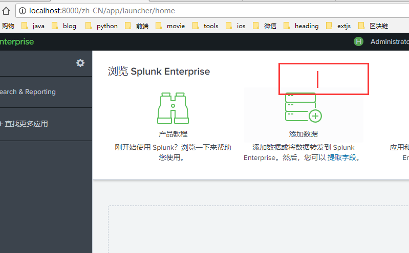
3. 选择字段进行检索，选取的字段即为展示的字段，感兴趣的字段匹配日志文件中所有字段，右键选择需要展示的字段： 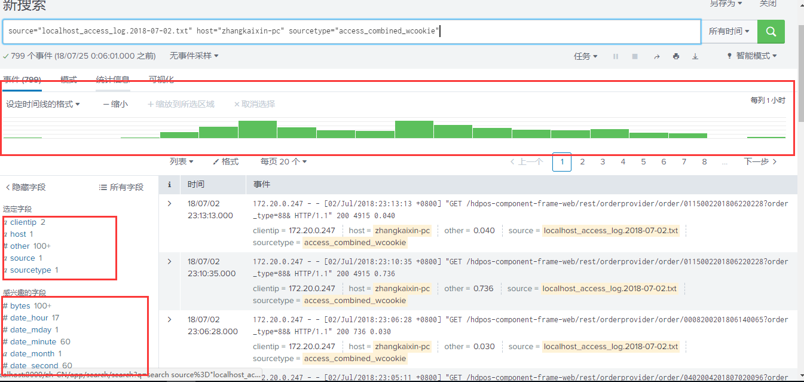
4. 右键选择选取的字段，进入展示界面，可以选择平均值，最高值等：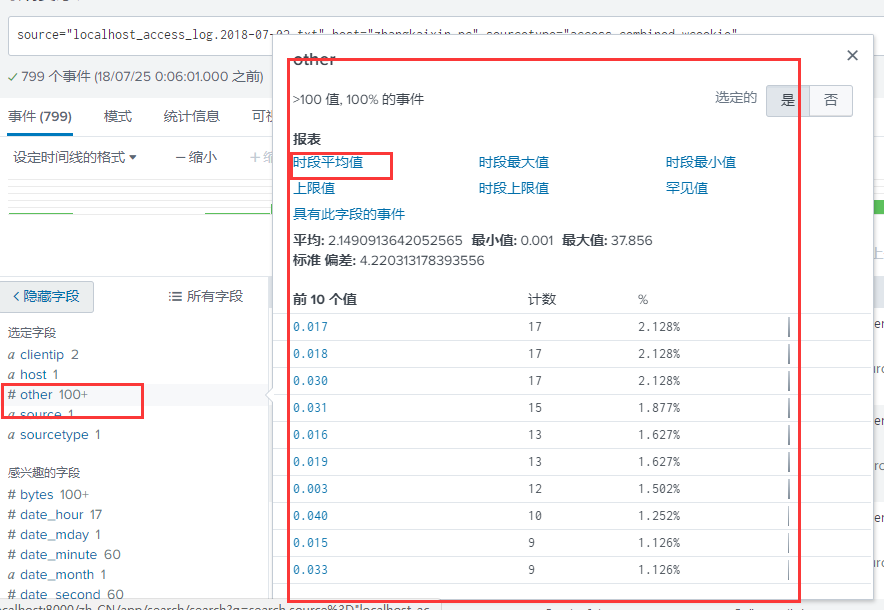
5. 选择平均，查看增加配置项之后结果。比较发现，查询一单电子发票的时间在一秒以内.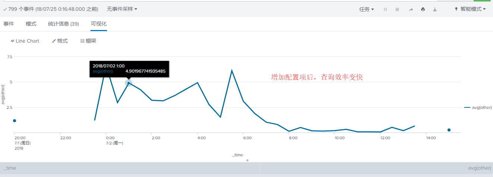

