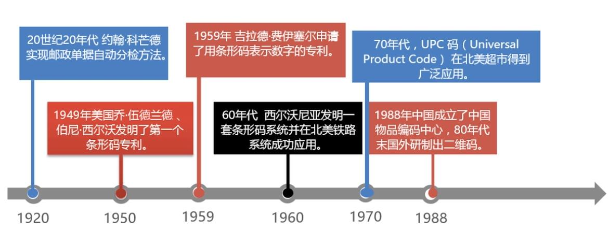
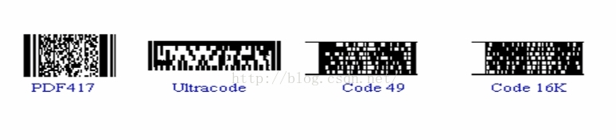
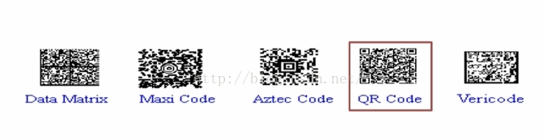
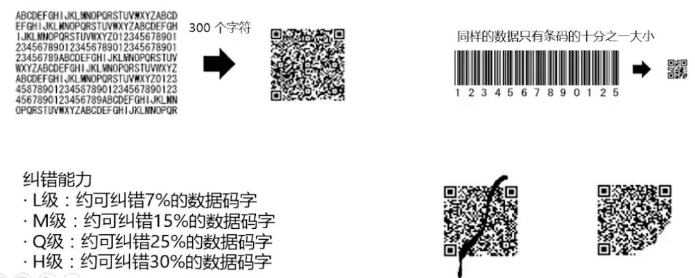

[资源:JAR包和参考代码](http://hddenv02/svn/hdposedu/20.技术专区/06_其他/知识分享20171122_二维码/doc)   
[二维码国家标准.pdf](http://hddenv02/svn/hdposedu/20.技术专区/06_其他/知识分享20171122_二维码/doc/GB-T18284-2000.pdf)    
[QRCode-编码解码标准(浏览器无法打开,请手动下载).pdf](http://hddenv02/svn/hdposedu/20.技术专区/06_其他/知识分享20171122_二维码/doc/QRCode-编码解码标准.pdf)   
## 1、二维码概念
二维条码/二维码(2-dimensional bar code)是用某种特定的几何图形按一定规律在平面(二维方向上)分布的黑白相间的图形记录数据符号信息的图形。在代码编制上巧妙地利用构成计算机内部逻辑基础的"0"、"1"比特流的概念，使用若干个与二进制相对应的几何形体来表示文字数值信息，通过图象输入设备或光电扫描设备自动识读以实现信息自动处理：它具有条码技术的一些共性：每种码制有其特定的字符集；每个字符占有一定的宽度；具有一定的校验功能等。同时还具有对不同行的信息自动识别功能、及处理图形旋转变化点。
## 2、二维码发展历史

1）一维条码是由一组粗细不同，黑白（或彩色）相同的条，空机器相应的字符（数字字母）组成的标记，即传统条码。

 2）二维条码是用某种特定的几何何图形按一定规律在平面（二维方向上）分布的条，空相间的图形来记录数据符号信息。
## 3、二维码分类
二维条码也有许多不同的码制，就码制的编码原理而言，通常分为三种类型：  
### 1）线性堆叠式二维码

编码原理：建立在一维条码基础之上，按需要堆积成两行或多行。
### 2）矩阵式二维码
最为常用的类型。
编码原理：在一个矩形空间通过黑，白像素在矩阵中的不同分布进行编码。
在矩阵相应元素位置上，用点（方点，圆点或者其他形状）的出现表示二进制 “1”，点的不出现表示二进制的 “0”

编码原理：在一个矩形空间通过黑，白像素在矩阵中的不同分布进行编码。
在矩阵相应元素位置上，用点（方点，圆点或者其他形状）的出现表示二进制 “1”，点的不出现表示二进制的 “0”
### 3）邮政码
编码原理：邮政码通过不同长度的条进行编码，主要用于邮件编码
如：POSTNET，BPO 4-STATE
## 4、二维码优缺点
优点：       
   1）高密度编码，信息容量大。   
   2）编码范围广(多语言)，文字，图片，网址，名片   
   3）容错能力强，损坏信息达到50%仍然可以正确读取    
   4）译码可靠性高，错误率极低，千万分之一   
   5）可引入加密措施，可防伪和保密   
   6）成本低，易制作，持久耐用   
缺点：  
   1）二维码技术成为手机病毒，钓鱼网站传播的新渠道   
   2）信息泄露  
## 5、QRcode实例
目前流行的三大国际标准：  
   1）PDF417：不支持中文  
   2）DM：专利未公开，需支付专利费用  
   3）QR Code：专利公开，支持中文  
   QR Code比其他二维码相比，具有识读速度快，数据密度大，占用空间小的优势.QR Code是由日本Denso公司于1994年研制的一种矩阵二维码符号码，全称是快速响应码。    

制作QR Code二维码的三种方式：
### 一. 通过使用zxing方式实现： 
jar准备：  下载源代码，将core/src/main/java/下的所有文件和javase/src/main/java/下的所有文件一起打成jar文件zxing.jar  
###### 1)创建二维码：  https://github.com/zxing 
###### 2)读取二维码：  https://github.com/zxing
### 二. 使用QRCode方式实现二维码
jar包准备：Qrcode\_A.jar，qrcode\_B.jar 
###### 1)创建二维码： http://www.swetake.com/qrcode/index-e.html  
###### 2)读取二维码： https://zh.osdn.net/projects/qrcode/
### 三. 使用js插件实现二维码
https://github.com/jeromeetienne/jquery-qrcode

js文件准备：jquery.min.js，jquery.qrcode.min.js 
导入js文件，然后编写代码，访问该页面。
