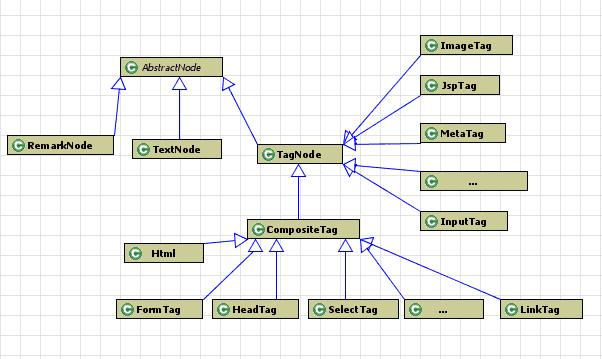
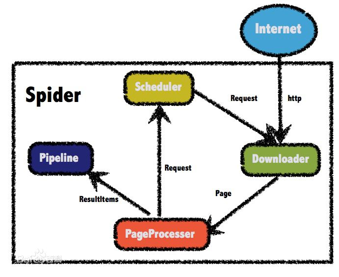

## 页面爬取得方式
### 1. 非结构化的数据
#### 1.1. HTML文本（包含JavaScript代码）
1. CSS选择器
2. XPATH，一种页面元素的路径选择方法
3. 正则表达式
4. 字符串分隔
#### 1.2. 一段文本
例如一篇文章，或者一句话，我们的初衷是提取有效信息，所以如果是滞后处理，可以直接存储，如果是需要实时提取有用信息。这些类容就需要特别的处理方式。

1. 分词
2. NLP（自然语言处理） 

#### 2. 结构化的数据
一般类似类似JSON，xml格式的字符串

## java 爬虫常用框架
### 1.jsoup
jsoup 是一款 Java 的 HTML 解析器，可直接解析某个 URL 地址、HTML 文本内容。它提供了一套非常省力的 API，可通过 DOM，CSS 以及类似于 jQuery 的操作方法来取出和操作数据。

主要功能：

1. 从一个 URL，文件或字符串中解析 HTML；
2. 使用 DOM 或 CSS 选择器来查找、取出数据；
3. 可操作 HTML 元素、属性、文本；

常用方法:

		getElementById(String id)
		getElementsByTag(String tag)
		getElementsByClass(String className)
		getElementsByAttribute(String key)

强大类似Jquery方式的选择器

1. tagname 使用标签名来定位，例如 a 
2. ns|tag     使用命名空间的标签定位，例如 fb:name 来查找 <fb:name> 元素 
3. #id     使用元素 id 定位，例如 #logo 
.class     使用元素的 class 属性定位，例如 .head 
4. [attribute] 使用元素的属性进行定位，例如 [href] 表示检索具有 href 属性的所有元素 
5. [^attr] 使用元素的属性名前缀进行定位，例如 [^data-] 用来查找 HTML5 的 dataset 属性 
6. [attr=value]使用属性值进行定位，例如 [width=500] 定位所有 width 属性值为 500 的元素 
7. [attr^=value],[attr$=value],[attr*=value] 这三个语法分别代表，属性以 value 开头、结尾以及包含 
8. [attr~=regex]使用正则表达式进行属性值的过滤，例如 img[src~=(?i)\.(png|jpe?g)] 

组合使用:

		1. el#id      定位id值某个元素，例如 a#logo -> <a id=logo href= … > 
		2. el.class 定位 class 为指定值的元素，例如 div.head -> 
xxxx
 
		3. el[attr] 定位所有定义了某属性的元素，例如 a[href]

过滤器：

1. :lt(n)，:gt(n)     例如 td:lt(3) 表示小于三列 gt大于
2. :eq(n)     form input:eq(1) 表示只包含一个 input 的表单 
3. :has(seletor)     div:has(p) 表示包含了 p 元素的 div 
4. :not(selector)     div:not(.logo) 表示不包含 class=logo 元素的所有 div 列表 
5. :contains(text)     包含某文本的元素，不区分大小写，例如 
6. :matches(regex)     使用正则表达式进行文本过滤：div:matches((?i)login) 
 

### 2.Htmlparser
htmlparser是一个纯的java写的html解析的库，主要用于改造或提取html，用来分析抓取到的网页信息是个不错的选择，Htmlparser是目前最好的html解析和分析的java工具之一，不依赖于其它的java库文件，能超高速解析html，并且不会出错。

通常结合httpclient+Htmlparser作为网页爬虫工具，基本能满足绝大数网站内容的爬取。

使用HtmlPaser的关键步骤：

1. 通过Parser类创建一个解释器
2. 创建Filter或者Visitor
3. 使用parser根据filter或者visitor来取得所有符合条件的节点
4. 对节点内容进行处理，节点保存信息结构如下：

可以查看api的方法来获取抓取节点，从而取的内容。

### 3.webmagic
WebMagic 是一款简单灵活的爬虫框架，由四个组件(Downloader、PageProcessor、Scheduler、Pipeline)构成，核心代码非常简单，主要是将这些组件结合并完成多线程的任务，总体结构如下图所示：

1. Downloader（下载器）负责从互联网上下载页面，以便后续处理。WebMagic默认使用了Apache HttpClient作为下载工具。
2. PageProcessor（页面处理器）负责解析页面，抽取有用信息，以及发现新的链接。WebMagic使用Jsoup作为HTML解析工具，并基于其开发了解析XPath的工具Xsoup。由于每个站点的每个页面都不一样，这是开发者着重开发定制的环节。
3. Scheduler（调度器）负责管理待抓取的URL，WebMagic默认提供了JDK的内存队列来管理URL，并用集合来进行去重。也支持使用Redis进行分布式管理。除非有特别需求，否则是不需要定制Scheduler
4. Pipeline（管道）负责抽取结果的处理，包括计算、持久化到文件、数据库等

### 关于需要登陆账号页面爬取得方法
1. 利用模拟浏览器登录得方式，采用HttpClient发送登陆请求，注意请求中需要发送得参数。
2. 第一步登陆成功后，使用登陆成功实例化得client（登陆成功后，HttpClient会记录登陆信息），利用client发送其他页面得请求
具体实现代码片段（以登陆csdn为例）:

		String html = HttpUtils.sendGet("https://passport.csdn.net/account/login?ref=toolbar");// 这个是登录的页面
   		Document doc = Jsoup.parse(html);
    	// 获取表单所在的节点
    	Element form = doc.select(".user-pass").get(0);
   		String lt = form.select("input[name=lt]").get(0).val();
    	String execution = form.select("input[name=execution]").get(0).val();
   	 	String _eventId = form.select("input[name=_eventId]").get(0).val();

    	// 开始构造登录的信息：账号、密码、以及三个标记信息
    	List<NameValuePair> nvps = new ArrayList<NameValuePair>();
    	nvps.add(new BasicNameValuePair("username", "账号"));
    	nvps.add(new BasicNameValuePair("password", "密码"));
    	nvps.add(new BasicNameValuePair("lt", lt));
    	nvps.add(new BasicNameValuePair("execution", execution));
    	nvps.add(new BasicNameValuePair("_eventId", _eventId));
		
		HttpPost post = new HttpPost(url);
		//client在以下请求成功后，即登陆成功
      	CloseableHttpClient client = HttpClients.createDefault();
      	post.setEntity(new UrlEncodedFormEntity(nvps));
      	String respContent = null;
      	HttpResponse resp = client.execute(post);
		//登陆成功
      	if (resp.getStatusLine().getStatusCode() == 200) {
        	//利用登陆成功得client从而获取登陆信息
			HttpGet request = new HttpGet("用户中心地址");
			//获取数据
			HttpResponse resp = client.execute(request);
      	}
		
