# 主题：Maven私服搭建

## 什么是Maven？
Maven 是 Apache 软件基金会组织维护的一款**自动化构建工具**，专注服务于 Java 平台的**项目构建和依赖管理**。

* **构建**——就是以我们编写的 Java 代码、框架配置文件、国际化等其他资源文件、JSP 页
面和图片等静态资源作为“原材料”，去“生产”出一个可以运行的项目的过程。

* 构建过程的几个主要环节
     * ①清理：删除以前的编译结果，为重新编译做好准备。
     * ②编译：将 Java 源程序编译为字节码文件。
     * ③测试：针对项目中的关键点进行测试，确保项目在迭代开发过程中关键点的正确性。
     * ④报告：在每一次测试后以标准的格式记录和展示测试结果。
     * ⑤打包：将一个包含诸多文件的工程封装为一个压缩文件用于安装或部署。Java 工程对应 jar 包，Web工程对应 war 包。
     * ⑥安装：在 Maven 环境下特指将打包的结果——jar 包或 war 包安装到本地仓库中。
     * ⑦部署：将打包的结果部署到远程仓库或将 war 包部署到服务器上运行。Maven可以自动的从构建过程的起点一直执行到终点。

## 为什么要使用Maven
* 添加第三方 jar 包，仅在本地仓库中保留一份。
* 解决jar 包之间的依赖关系，自动导入依赖的jar包。
* 获取第三方 jar 包，可以从中央仓库中获取统一规范的jar包。
* 将项目拆分成多个工程模块，以便团队人员协同开发。

## Maven中的仓库管理
* 本地仓库：为当前本机电脑上的所有 Maven 工程服务。
* 远程仓库
  * 私服：架设在当前局域网环境下，为当前局域网范围内的所有 Maven 工程服务。
			
		用户 <---> 私服 <---中央仓库、其他仓库  
  * 中央仓库：架设在 Internet 上，为全世界所有 Maven 工程服务。
  * 中央仓库的镜像：架设在各个大洲，为中央仓库分担流量。减轻中央仓库的压力，同时更快的响应用户请求。
- 仓库中的文件：Maven 的插件；我们自己开发的项目的模块；第三方框架或工具的 jar 包。不管是什么样的 jar 包，在仓库中都是按照坐标生成目录结构，所以可以通过统一的方式查询或依赖。

## 使用Maven私服的好处
* 节省外网带宽
* 加速Maven构建
* 部署第三方构件
* 提高稳定性
* 降低中央仓库负荷
- 应用场景：内网开发、项目工程中jar包放到同一服务器上，实现统一管理和团队之间的共享。

## Maven私服搭建(Windows)
我们可以使用专门的 Maven 仓库管理软件来搭建私服，比如：Apache Archiva，Artifactory，Sonatype Nexus。这里我们使用 Sonatype Nexus。

> 下载与安装

* **下载地址**：https://www.sonatype.com/download-oss-sonatype
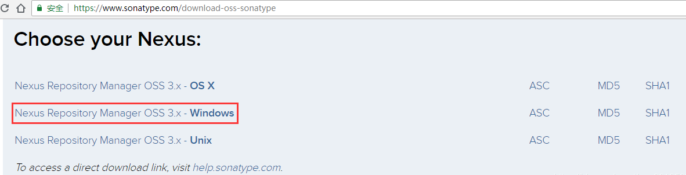

* **安装**:（可以安装成Windows服务）
  * 将下载后的压缩文件解压到自己想要的位置。
  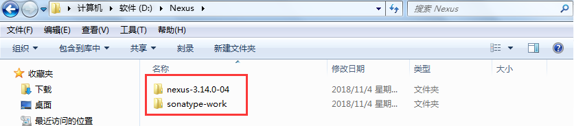

  * 使用管理员方式进入cmd，进入到D:\Nexus\nexus-3.14.0-04\bin。
		* 安装：nexus.exe /install Nexus
		* 启动：nexus.exe /start Nexus
		* 停止：nexus.exe /stop Nexus
		* 卸载：nexus.exe /uninstall Nexus
		* Nexus：为自定义Windows服务名称。
  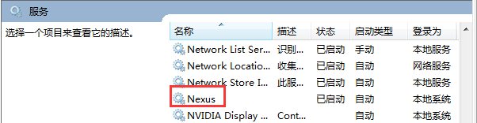

  * 如果不想安装成Windows服务，可以使用命令 nexus.exe /run。如下，启动成功。
  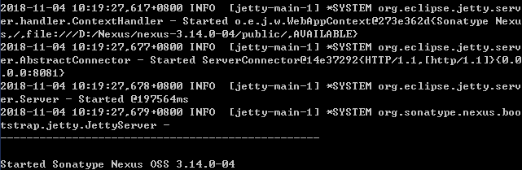

  * 修改一些配置。D:\Nexus\nexus-3.14.0-04\bin\nexus.vmoptions
  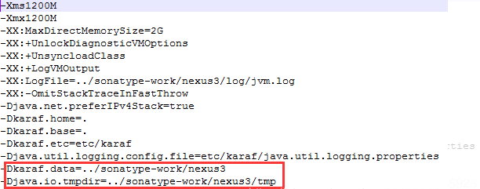

		D:\Nexus\nexus-3.14.0-04\etc\nexus-default.properties
  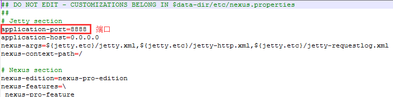

  * 访问和修改admin密码。
  
		URL：http://localhost:8888/

		用户名/密码：admin/admin123

		修改密码时第一次要验证身份，输入之前的密码，即admin123
	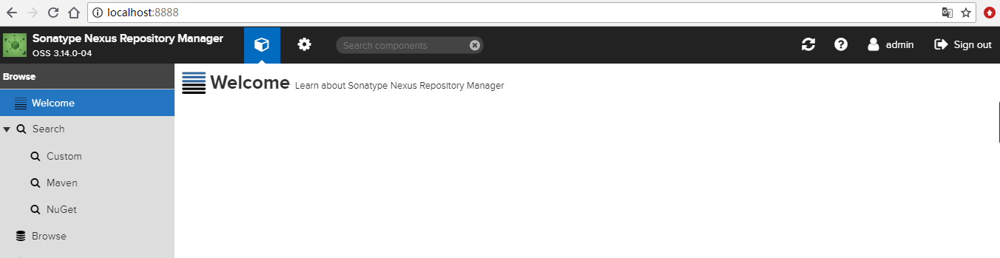
	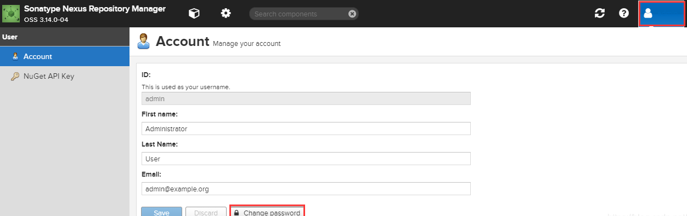
  
  * 界面认识
  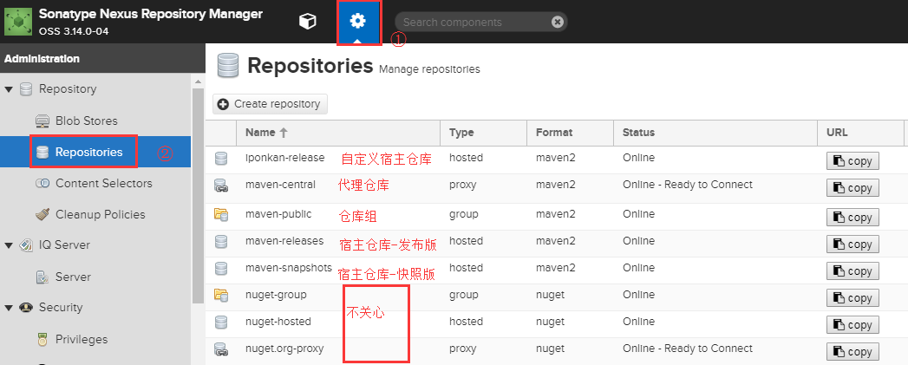

> Maven配置

1. settings.xml配置

	* 指定本地仓库位置
	
	```	
		<localRepository>E:/ApacheMavenRepository</localRepository>
	```
	

	* 配置Nexus认证信息，**注意：**文件使用utf-8保存，不然可能会在eclipse中出现无法解析
	

	```

		<server>
			<id>nexus-releases</id>
			<username>admin</username>
			<password>admin123</password>
		</server>
		<server>
			<id>nexus-snapshots</id>
			<username>admin</username>
			<password>admin123</password>
		</server>
	```

	* 配置镜像，让所有的Maven请求都走私服
	
	```

		<mirror>
      		<id>nexus</id>
      		<mirrorOf>*</mirrorOf>
      		<name>all maven</name>
     		 <url>http://localhost:8888/repository/maven-public/</url>
   		</mirror> 
	```

	* 配置仓库和插件仓库，开启快照版本支持。其中id均为central，会覆盖超级pom中央仓库的配置，与url无关紧要，所以url随意。因为所有的请求都会通过镜像访问私服地址。

	```

		<profile>  
        <id>nexus</id>  
		<repositories>  
			<repository>  
				<id>central</id>                                     
				<url>http://central</url>                      
				<releases>  
					<enabled>true</enabled>  
				</releases>  
				<snapshots>  
					<enabled>true</enabled>  
				</snapshots>  
			</repository>  
		</repositories>     
		<pluginRepositories>  
			<pluginRepository>  
			  <id>central</id>  
			  <url>http://central</url>  
			  <releases>  
				<enabled>true</enabled>  
			  </releases>  
			  <snapshots>  
				<enabled>true</enabled>  
			  </snapshots>  
			</pluginRepository>  
		</pluginRepositories>  
	</profile> 
	```

	* 激活profile
	
	```

		<activeProfiles>
    		<activeProfile>nexus</activeProfile>
  		</activeProfiles>
	```

> 通过Eclipse上传jar到Nexus私服

* 配置项目pom，上传到快照宿主仓库中。
	
	```
   
		<distributionManagement>
		<repository>
			<id>nexus-snapshots</id>
			<name>nexus snapshots repository</name>
			<url>http://localhost:8888/repository/maven-snapshots/</url>
		</repository>
	</distributionManagement>
	```

* 发布

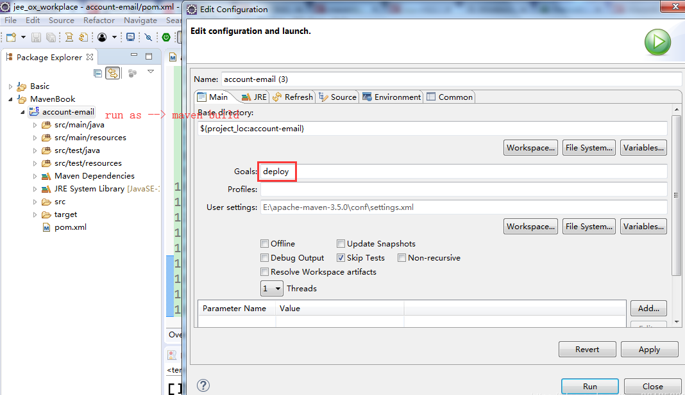

注意：这里可能出现一个编译错误：就是需要jre而不是java。如果出现这个错误请做如下处理。
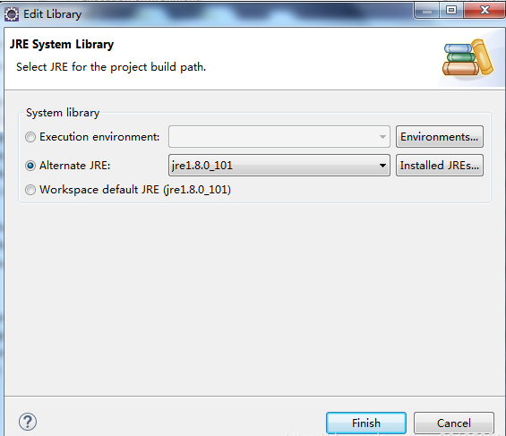

* 私服中查看结果
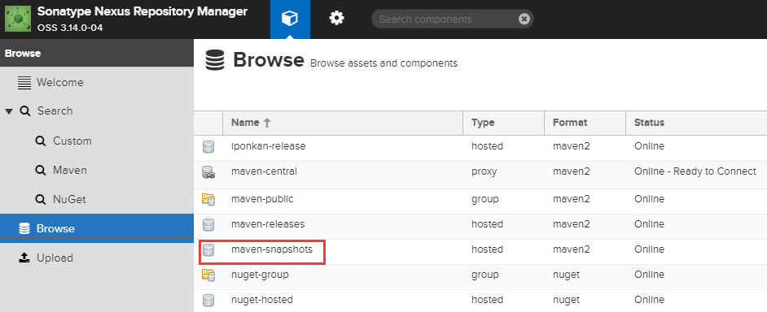
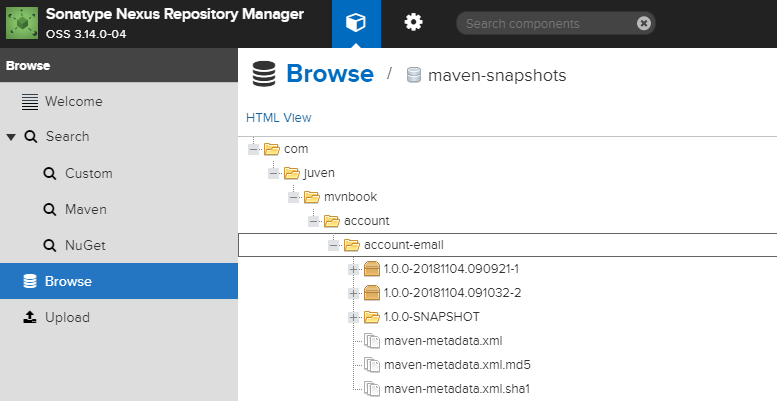

* 删除上传到私服中的jar
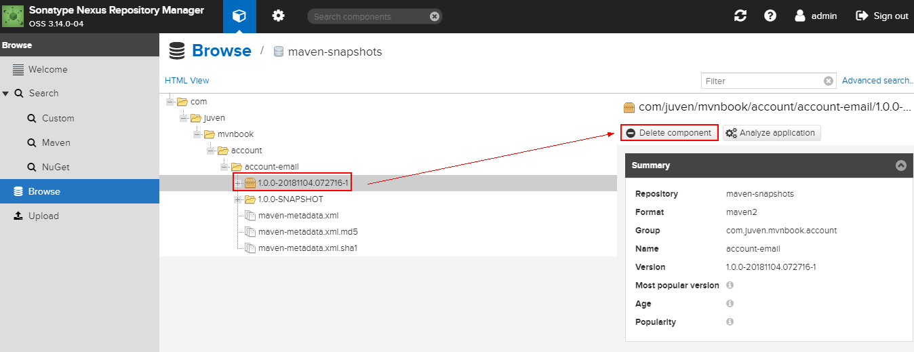

> 通过Nexus界面上传oracle jdbc驱动到私服中


1. 下载oracle jdbc驱动：https://www.oracle.com/technetwork/database/enterprise-edition/jdbc-112010-090769.html
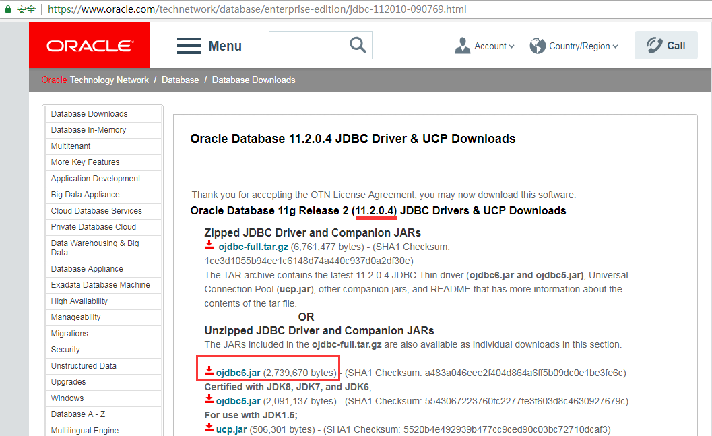

2. 界面上传
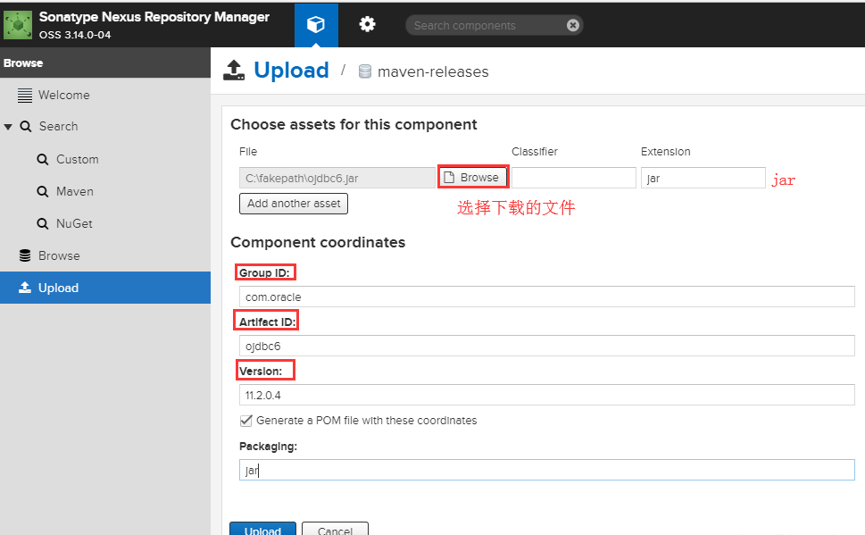

3. 查看上传结果，具体在项目中可以通过以上gav使用。
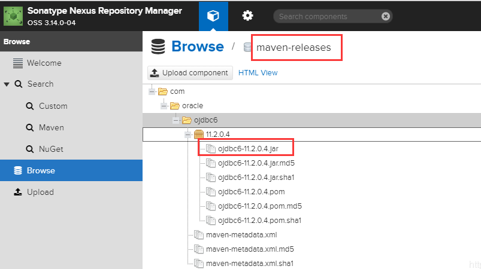

> 通过命令上传oralce jdbc驱动

	mvn deploy:deploy-file -DgroupId=com.oracle -DartifactId=ojdbc6 -Dversion=11.2.0.4 -Dpackaging=jar -Dfile=D:\迅雷下载\ojdbc6.jar -Durl=http://localhost:8888/repository/maven-releases/ -DrepositoryId=maven-releases
