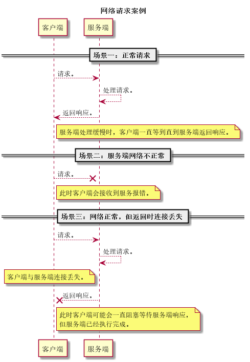
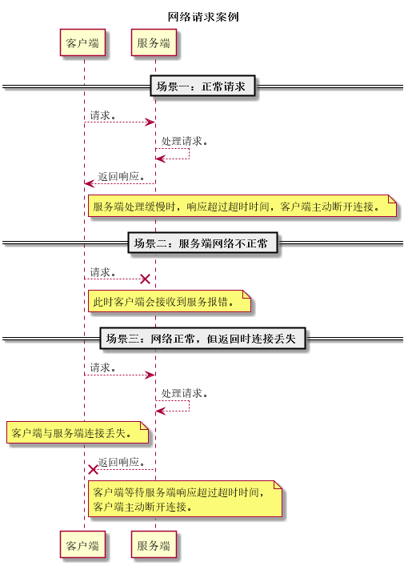

### 一、引言
随着企业系统的发展，应用多采用分布式结构，严重依赖于网络的稳定性。但由于网络天生的不稳定性，系统开发过程中需要考虑网络不稳定情况下如何保证应用的鲁棒性。 设置网络超时是其中一种保证应用健壮性的手段。 设置网络超时设置后，请求在设定时间能未完成将被强制终止，保证程序不出现无限制的线程阻塞情况，有效的提高了应用的可用性。

### 二、未设置超时与设置超时情况对比
#### 1. 网络请求图例：

 

#### 2. 设置超时时间后，请求图例：

### 三、常见的网络超时设置
#### 1. httpclient超时设置(Spring bean)

1. 配置

		<bean id="multiThreadedHttpConnectionManager"
		  class="org.apache.commons.httpclient.MultiThreadedHttpConnectionManager">
		  <property name="params">
		    <bean
		      class="org.apache.commons.httpclient.params.HttpConnectionManagerParams">
		      <property name="maxTotalConnections" value="${maxTotalConnections:300}" />
		      <property name="defaultMaxConnectionsPerHost" value="${defaultMaxConnectionsPerHost:300}" />
			  <!-- 连接超时，毫秒。 -->
		      <property name="connectionTimeout" value="${connectTimeout:10000}" />
			  <!-- socket超时，毫秒。 -->
		      <property name="soTimeout" value="${readTimeout:600000}" />
		      <property name="staleCheckingEnabled" value="${staleCheckingEnabled:true}" />
		    </bean>
		  </property>
		</bean>
		
		<bean id="httpClient" class="org.apache.commons.httpclient.HttpClient">
		  <constructor-arg>
		    <ref bean="multiThreadedHttpConnectionManager" />
		  </constructor-arg>
		</bean>

2. httpinvoker使用场景

配置HttpInvokerRequestExecutor，覆盖HttpInvokerProxyFactoryBean中默认使用的的SimpleHttpInvokerRequestExecutor，并配置网络超时。见《配置》。

		<bean id="httpInvokerRequestExecutor"
		  class="org.springframework.remoting.httpinvoker.CommonsHttpInvokerRequestExecutor">
		  <constructor-arg>
		    <ref bean="httpClient" />
		  </constructor-arg>
		</bean>
		
		<bean id="xxxxService"
		  class="org.springframework.remoting.httpinvoker.HttpInvokerProxyFactoryBean">
		  <property name="serviceUrl" value="${xxxxServiceUrl}" />
		  <property name="serviceInterface" value="com.xxxxService" />
		  <property name="httpInvokerRequestExecutor" ref="httpInvokerRequestExecutor" />
		</bean>

#### 2. HttpClient超时设置（硬编码）
1. 样例

		RequestConfig config = RequestConfig.custom()
		    .setSocketTimeout(1*1000)  // socket套接字超时，毫秒。
		    .setConnectionRequestTimeout(1*1000) //使用连接池来管理连接时，从连接池获取连接的超时时间，毫秒。
		    .setConnectTimeout(5*1000) // 连接建立超时，毫秒。
		    .build();
		CloseableHttpClient httpClient = HttpClients.custom()
		    .setDefaultRequestConfig(config) //
		    .build();
		CloseableHttpResponse httpResponse = httpClient.execute(httpGet); // 执行请求

2. 参考
	1. [HttpClient三个超时选项](http://blog.csdn.net/btlas/article/details/53710854)

#### 3. 邮件超时设置
基于Spring框架开发的项目可以很方便的使用
org.springframework.mail.javamail.JavaMailSenderImpl实现邮件提醒等功能。

1. 配置

		<bean id="mailSender" class="org.springframework.mail.javamail.JavaMailSenderImpl"
		  p:host="${mailSender.host}" p:username="${mailSender.username}"
		  p:password="${mailSender.password}">
		  <property name="javaMailProperties">
		    <props>
		      <prop key="mail.smtp.auth">${mailSender.smtp.auth:true}
		      </prop>
		      <prop key="mail.smtp.timeout">${mailSender.smtp.timeout:10000}
		      </prop>
		      <prop key="mail.smtp.connectiontimeout">${mailSender.smtp.connectiontimeout:10000}
		      </prop>
		    </props>
		  </property>
		</bean>

2. javaMailProperties说明
   1. mail.smtp.timeout ： smtp邮件服务器读取超时。
   2. mail.smtp.connectiontimeout ： smtp邮件服务器连接超时。
   3. mail.smtp.auth ： 是否认证用户。

    注： property参数名列表可查询JavaMail API documentation。

3. 参考
	1. [JavaMail API documentation](https://javaee.github.io/javamail/docs/api/)
	2. [JavaMail Reference Implementation](https://javaee.github.io/javamail/)

